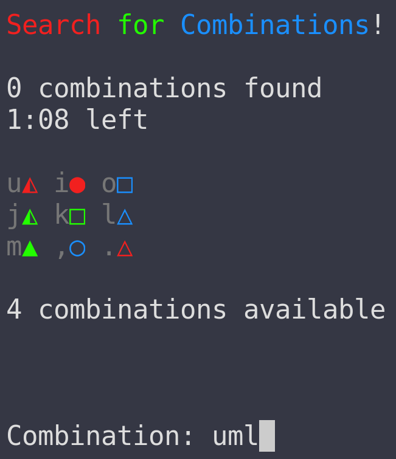

# Search for Combinations!

Rip-off of [Find the Sets](https://play.google.com/store/apps/details?id=nl.borkoek.set&pcampaignid=web_share).

  

## Gameplay

Run the game with `python main.py`. In each round type 3 positions (indicated in gray next to each object) and press enter. The game ends after 2 minutes.

## Rules

The goal of the game is to find as many correct combinations of three objects as possible.

Each object has three properties with three options each

* **Shape**: triangle, square, circle
* **Color**: red, green, blue
* **Fill**: full, half, empty

A combination is valid when the objects are either **all the same** or **all different** across the 3 properties. In other words, there can be no pairs in any of the properties.

**Example**: `uml` is correct because **all** of them are triangles, and they have **different** fills and **different** colors.

**Anti-Example 1**: `uio` is incorrect because **two** of them are red.

**Anti-Example 2**: `ujl` is incorrect because **two** of them are half-filled.

**Anti-Example 3**: `um,` is incorrect because **two** of them are triangles.
